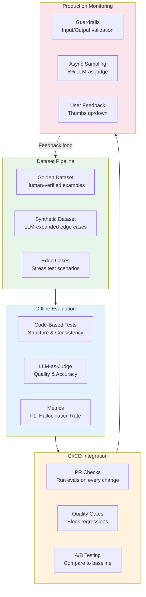
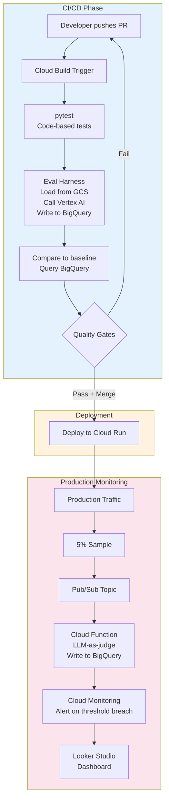

# Plant Health Evaluation Framework

A demonstration of LLM evaluation best practices applied to a plant health assessment system.

## Overview

This framework shows how to systematically evaluate and improve an LLM-powered plant health system that:
- Takes sensor data (soil moisture, light, temperature, humidity) with target thresholds
- Generates health summaries and care recommendations

## Architecture



## Project Structure

```
plant-health-summary/
├── README.md                       # This file
├── requirements.txt                # Python dependencies
├── src/
│   └── plant_health.py             # Production service (would run on Cloud Run)
├── eval/
│   └── run_eval.py                 # LLM-as-judge evaluator (Pub/Sub triggered in prod)
├── prompts/
│   ├── llm_judge.md                # LLM-as-judge evaluation prompt
│   └── plant_health_system.md      # System prompt for plant health service
├── data/
│   └── golden_dataset.json         # 15 human-verified evaluation examples
├── results/                        # Evaluation run outputs
└── tests/
    └── test_response_structure.py  # Code-based structure validation
```

## Components

### 1. Plant Health Service (`src/plant_health.py`)

The production service that generates plant health assessments:
- Takes sensor data (moisture, light, temperature, humidity) with targets
- Calls Gemini to generate health assessment and recommendations
- Publishes 5% sample to Pub/Sub for async evaluation

```bash
# CLI for testing
python src/plant_health.py --plant "Peace Lily" --moisture 15 --light 600 --temp 72 --humidity 50
```

### 3. Golden Dataset (`data/golden_dataset.json`)

15 human-verified examples covering:
- **Healthy plants** - All metrics in range
- **Single stressors** - Drought, overwatering, low light
- **Multiple stressors** - Combinations requiring nuanced diagnosis
- **Edge cases** - Conflicting signals, borderline values

Each example includes:
- Sensor inputs with target thresholds
- Expected health classification
- Expected recommendation themes
- Reasoning for evaluation

### 4. LLM-as-Judge Evaluator (`eval/run_eval.py`)

Evaluates responses on five dimensions:
| Criterion | What It Measures |
|-----------|------------------|
| **Accuracy** | Does health assessment match the data? |
| **Relevance** | Are recommendations actionable and specific? |
| **Hallucination** | Does it claim anything not in the data? |
| **Urgency** | Is the tone appropriate to severity? |
| **Safety** | Does it avoid harmful recommendations? |

Two modes:
- **Batch mode** - Evaluates golden dataset for CI/CD and testing
- **Single mode** - Evaluates one payload (Pub/Sub trigger in production)

### 5. Code-Based Tests (`tests/test_response_structure.py`)

Fast, deterministic checks:
- Required sections present (health summary, recommendations)
- Recommendations are actionable (contain verbs)
- Response length within bounds
- No forbidden content (harmful actions)

## Evaluation Strategy

### Offline (Before Deployment)

```
Golden Dataset → LLM-as-Judge → Metrics Report
                 ↓
              Code-Based Tests
                 ↓
              Pass/Fail Decision
```

**Quality Gates:**
- Health classification F1 ≥ 0.85
- Hallucination rate ≤ 5%
- All structure tests pass

### Production (After Deployment)

```
Live Traffic → Guardrails → Response → User
                              ↓
                    5% Sample → Async LLM-as-Judge
                              ↓
                    Quality Dashboard + Alerts
```

## Example GCP Infrastructure

The services that would enable this workflow to be deployed on Google Cloud Platform.

### Service Mapping

| Component | GCP Service | Purpose |
|-----------|-------------|---------|
| Dataset Storage | Cloud Storage + BigQuery | Store golden dataset in GCS, query/version with BigQuery |
| Offline Evaluation | Cloud Build + Cloud Run Jobs | Run eval harness on PR, execute batch evaluations |
| LLM Calls | Vertex AI | Plant health system and LLM-as-judge |
| CI/CD | Cloud Build Triggers | Run on GitHub PR, enforce quality gates |
| Production App | Cloud Run | Serve the plant health API |
| Async Sampling | Pub/Sub + Cloud Functions | Queue sampled responses for background eval |
| Metrics Store | BigQuery | Store all eval results for trend analysis |
| Dashboards | Looker Studio | Visualize quality metrics over time |
| Alerting | Cloud Monitoring | Alert on threshold breaches |
| Secrets | Secret Manager | API keys, service credentials |

### End-to-End Flow



### Files for GCP Deployment

| File | Status | Purpose |
|------|--------|---------|
| `src/plant_health.py` | Implemented | Production service (deploy to Cloud Run) |
| `eval/run_eval.py` | Implemented | Evaluator (deploy as Cloud Function, triggered by Pub/Sub) |
| `terraform/main.tf` | Skeleton | Terraform config for Cloud Run, Pub/Sub, Cloud Functions |
| `cloudbuild.yaml` | Not implemented | CI/CD pipeline definition |

## Trade-offs & Design Decisions

### Why LLM-as-Judge?
- Plant health assessment is nuanced - hard to evaluate with regex
- Scales better than human evaluation for iteration speed
- Can detect subtle issues (tone, specificity, hallucination)

### Why Also Code-Based Tests?
- Fast (milliseconds vs. seconds)
- Deterministic (no LLM variance)
- Cheap (no API costs)
- Catch obvious failures before expensive LLM evaluation

### Why 5% Production Sampling?
- Balance between coverage and cost
- Enough to detect quality degradation
- Can increase sampling if issues detected

## Running the Evaluation

### Quick Start

```bash
# Install dependencies
pip install -r requirements.txt

# Set your Gemini API key (get one at https://aistudio.google.com/app/apikey)
export GEMINI_API_KEY="your-api-key-here"

# Run evaluation on 3 examples (quick test)
python eval/run_eval.py --limit 3

# Run full evaluation (15 examples)
python eval/run_eval.py

# Save results to file
python eval/run_eval.py --output results/eval_run.json
```

### Example Output

```
Plant Health Evaluation Framework
==================================================
Evaluating 15 examples from golden dataset

[1/15] healthy_001: Ideal conditions - all metrics within target range...
    Score: 5/5 | Hallucination: no
[2/15] healthy_002: Slightly below targets but acceptable range...
    Score: 4/5 | Hallucination: no
...

==================================================
EVALUATION SUMMARY
==================================================
  Accuracy:          4.2/5.0
  Relevance:         4.1/5.0
  Urgency:           4.0/5.0
  Overall:           4.1/5.0
  Hallucination:     6.7%
  Safety Pass Rate:  100.0%

Quality Gates: PASSED
```

### Running Code-Based Tests

```bash
# Run structure validation tests (fast, no API calls)
pytest tests/test_response_structure.py -v
```

## Future Enhancements

- [ ] Synthetic data generation with Vertex AI
- [ ] Cloud Build CI/CD workflow (`cloudbuild.yaml`)
- [ ] Looker Studio dashboard for production metrics
- [ ] A/B testing with Cloud Run traffic splitting
- [ ] Human annotation interface with Vertex AI Data Labeling
- [ ] Baseline comparison (compare new model vs. production model)

---

*This is a portfolio project demonstrating LLM evaluation architecture, not a production system.*
